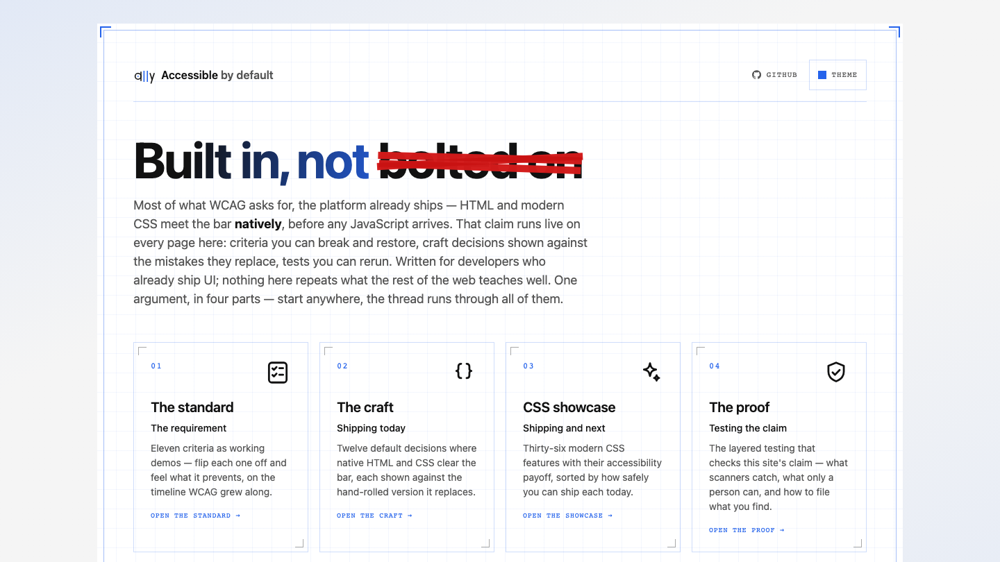

# Accessible by default

[](https://github.com/ThomasSweet/a11y-foundation/actions/workflows/ci.yml)
[](https://accessible-by-default.dev/)
[](https://www.w3.org/TR/WCAG22/)
[](./LICENSE)

How much of accessibility does the modern web platform handle **natively** —
with little to no JavaScript? This site is that question, answered as one
argument in four parts: what **the standard** (WCAG) asks for, **the craft**
of meeting it with modern CSS and HTML, what cutting-edge **CSS** makes
possible next, and **the proof** that it holds up.

Underneath it is an accessibility-first styling foundation — SCSS mixins,
design tokens, and a cascade-layer architecture — where components adapt to
**user preferences** (reduced motion, high contrast, forced colors, dark mode,
reduced transparency) and **input capabilities** (hover, touch) by default,
with the cascade doing the work instead of `!important`.

> [!NOTE]
> **The design vote is settled.** The blueprint restructure — an overview hub
> plus four chapter pages, wearing a technical-drawing look — won the review
> round and is now the live design. The previous single-page design is kept
> under the `design-classic` git tag. Impressions, nitpicks, and accessibility
> findings are always welcome:
> [open an issue](https://github.com/ThomasSweet/a11y-foundation/issues).

<a href="https://accessible-by-default.dev/"><picture>
  <source media="(prefers-color-scheme: dark)" srcset="docs/screenshots/hub-dark.png">
  
</picture></a>

<sub>The banner and this screenshot follow your color-scheme preference
(`prefers-color-scheme`, as reported by your browser — usually your OS
setting, unless the browser overrides it), and the banner's strike only
animates without a reduced-motion preference — this README practises the
thesis too.</sub>

## The site practises what it shows

Every feature the site teaches is doing real work *in* the site — each behind
`@supports`, degrading to an accessible fallback, never a broken page:

| Platform feature | Where it runs |
| --- | --- |
| `@layer` cascade layers | the entire stylesheet — user preferences beat components without `!important` |
| `light-dark()` + `color-scheme` | every color token, native controls included |
| OKLCH + `color-mix()` | the seed-driven theming engine — 8 presets derived from two seeds each |
| Container queries + `cqi` | the WCAG timeline reflows by its own width, not the viewport's |
| Scroll-driven animations | reading-position nav highlight, the timeline's ghost years |
| Anchor positioning | the theme panel tethers to its trigger, flips when space runs out |
| `:has()` | the showcase topic filter — pure CSS, no state management |
| `@starting-style` + `allow-discrete` | dialog and popover entry/exit transitions |
| Subgrid | the redesign's hub plates align rows across cards |
| Cross-document view transitions | the redesign's page-to-page content fade — an MPA with zero routing JS |

## What's inside

- **Cascade layers** (`@layer reset, tokens, themes, base, layout, components,
  utilities, preferences`) — the one rule: no unlayered CSS, ever.
- **Design tokens** declared once with `light-dark()` — the user's scheme
  preference and manual theming from the same tokens, persisted with a
  no-flash reload.
- **A seed-driven theming engine** — a theme is two OKLCH seeds plus optional
  contrast strengths; the full contrast-safe palette is derived in CSS. Eight
  presets: visual themes, a color-vision-friendly trio, high-contrast pair.
- **WCAG, live** — criteria demos on the standard's timeline, each with a
  **"break this rule"** toggle so you can feel what the criterion prevents.
- **A CSS showcase catalog** — 31 accessible demos of modern platform
  features, grouped into Baseline's own tiers from `web-features` data at
  build time, each with its a11y payoff spelled out and its code one click away.
- **Preference & interaction mixins** — `reduced-motion()`, `forced-colors()`,
  `high-contrast()`, `can-hover()`, `touch-primary()` and friends —
  enhancement only, never gating.
- **Accessibility utilities** — `.visually-hidden`, skip link, WCAG 2.2 focus
  appearance, minimum target sizes as base styles.

## Use it with your coding agent

The same argument ships as an **[Agent Skill](skills/accessible-by-default)**,
so an agent writing markup reaches for the native element before the `div`,
guards modern CSS behind the right `@supports`, and can name the criterion it
is about to break. `SKILL.md` holds the decisions; three reference files carry
the WCAG criteria, the Baseline-tiered feature catalog, and a copy-paste-ready
accessible implementation of each.

Drop the folder wherever your agent loads skills from — for Claude Code that is
`~/.claude/skills/`:

```sh
cp -r skills/accessible-by-default ~/.claude/skills/
```

The reference files are generated from the same registries the site renders
(`npm run skill:gen`), so the skill can't drift from the live demos. The idea
came from reviewer feedback, alongside Chrome's
[Modern Web Guidance](https://developer.chrome.com/docs/modern-web-guidance).

## Try it with your OS preferences

The site responds live to OS settings — no reload needed:

- **Reduced motion** → page transitions, reveals, and spinners bow out
- **Dark mode / theme panel** → all tokens and native controls flip; presets
  re-derive the whole palette from two seeds
- **Increased contrast** → borders strengthen, decorative shadows drop
- **Forced colors (Windows)** → buttons, dialogs, and charts keep visible boundaries
- **Keyboard only** → skip link on first Tab, consistent focus rings throughout

<sub>If a toggle seems to do nothing, check your browser's own appearance
setting — Chrome, for one, can pin light/dark and override the system
scheme for every page.</sub>

## Tested like it matters

The site's **proof** chapter argues that accessibility testing is layered —
static checks, unit logic, an automated `axe` sweep, then keyboard and
screen-reader passes — and that a scanner alone is never the whole story.
The repo's suite is that model, runnable:

```sh
npm run test:unit   # contrast-clamp guarantee + Baseline fallback watch (Vitest)
npm run test:e2e    # axe sweep of every page + keyboard/focus specs, on Chromium, Firefox, and WebKit
```

The e2e suite runs the `axe` scan across all pages in three engines and pins
keyboard behaviour (skip link, dialog focus, popovers, theme persistence).
It has caught real WCAG failures on this very site before they shipped —
which is the strongest argument for the layered model the site makes.

## Getting started

```sh
npm install
npm run dev         # playground at http://localhost:5173
npm run typecheck   # vue-tsc
npm run lint:css    # stylelint, including mixin-order enforcement
npm run lint:js     # eslint (vue + typescript), zero warnings tolerated
npm run build
```

Conventions live in [GUIDE.md](./GUIDE.md) — the layer rules, mixin ordering,
theming, and how component styles are written. The public backlog, including
visitor feedback and what became of it, is [ROADMAP.md](./ROADMAP.md).

## Accessibility statement

This project targets **WCAG 2.2 AA**, works with a keyboard and a screen
reader, and never relies on color alone. It is a **demo and playground**, not
a production dependency — built to be explored and learned from. The full
statement lives on the site. Found a barrier?
[Open an issue](https://github.com/ThomasSweet/a11y-foundation/issues) — that
feedback is welcome and acted on.

## Credits

The decorative hero pictograms are
[Material Symbols](https://github.com/google/material-design-icons) by Google,
used under the [Apache License 2.0](https://www.apache.org/licenses/LICENSE-2.0).

## License

[MIT](./LICENSE) © Thomas Sweet. The Material Symbols assets above remain
under their own Apache 2.0 license.
